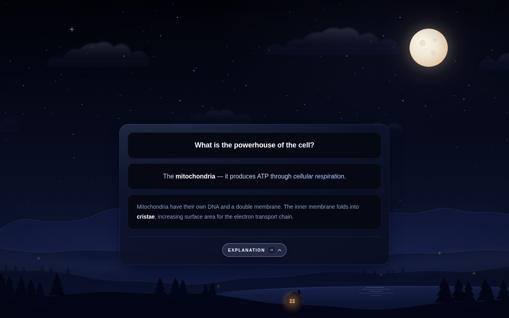
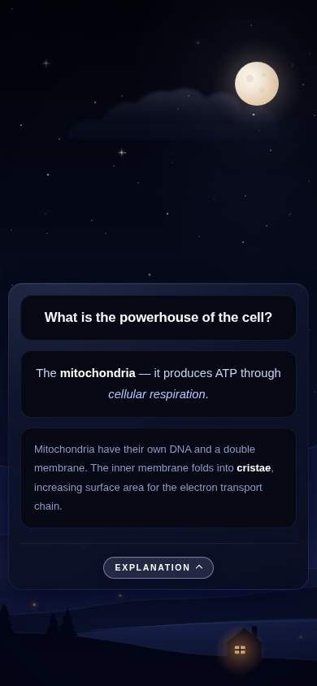

# Moonlit Hills — Anki card theme

A modern, sleek Anki note type styling: a dark glass card floating over a subtle,
**looping night scene** — moonlit mountains, layered hills fading into mist, a still
lake reflecting the moon, pine treelines, a cabin with a warm window,
a soft moon, faint twinkling stars, drifting cumulus clouds and mist, fireflies and the
occasional shooting star.

Shadows lean **dark blue**. The scene keeps a few warm orange accents (moon, cabin,
fireflies); the card itself uses cool white highlights only.

| Answer (desktop) | Answer (phone) |
| --- | --- |
|  |  |

## Files

| File | Paste into (Tools → Manage Note Types → Cards…) |
| --- | --- |
| `front.html` | **Front Template** |
| `back.html`  | **Back Template** |
| `styling.css` | **Styling** |

The note type needs the fields **Front**, **Back** and **Explanation**.

## Features

- **Smooth, lightweight transitions** — the background is drawn once and kept alive
  across sides and cards, so only the card in the middle changes. The scene is inline
  SVG (fully painted on the first frame, nothing pops in), uses system fonts (no
  network font reflow), and every moving layer only animates `transform`/`opacity`
  on the GPU — an idle card does no repainting at all.
- **Centred card, steady question** — the card is vertically centred by its front-side
  height on both sides, so on flip the question stays put and the answer slides open
  below it (pure CSS reveal). The card sits on its own GPU layer so text never shimmers.
- **Explanation drawer** — click the button, press **H** on desktop, or bind
  AnkiDroid's *User Action 1* (`userJs1`). The button is disabled when the card has no
  explanation, and appears (disabled) on the front so the layout never shifts.
  It sits centred under the card.
- **Responsive** — no fixed `min-width`s; works on phones (AnkiDroid / AnkiMobile).
- **Accessible** — honours the OS *reduce motion* setting, keyboard focus styles,
  `aria-expanded` on the toggle.
- Optional HUD (`#gm-time-box`, `#gm-streak-box`) and milestone overlay
  (`#gm-milestone`) styles are kept for add-ons/scripts that inject them.

## What changed vs. the old "Dark Console" theme

- Hard-coded `min-width: 680px / 568px` removed — the card no longer overflows on mobile.
- ~80 lines of height-measuring JS replaced by CSS `grid-template-rows` transitions.
- Hotkey handler no longer captures stale DOM nodes between cards and ignores
  modifier keys / text inputs.
- Duplicate `{{^Explanation}}` button branch removed; one footer button for every card.
- All colours, radii and shadows are CSS custom properties at the top of `styling.css`
  — tweak the palette in one place.

## Editing the templates

`front.html` and `back.html` are generated. Edit the files in `src/` (the night scene
lives once in `src/scene.html`, card centring in `src/place.html`), then run:

```sh
python3 tools/gen_hills.py   # only if you changed the landscape generator
python3 tools/build.py
```

## Local preview

```sh
python3 preview/build.py   # writes preview/front.html and preview/back.html
```

Open the generated files in a browser (press **H** on the back preview).
